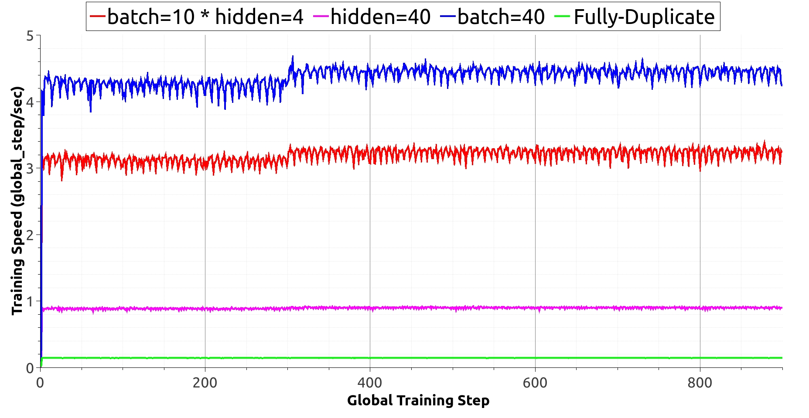
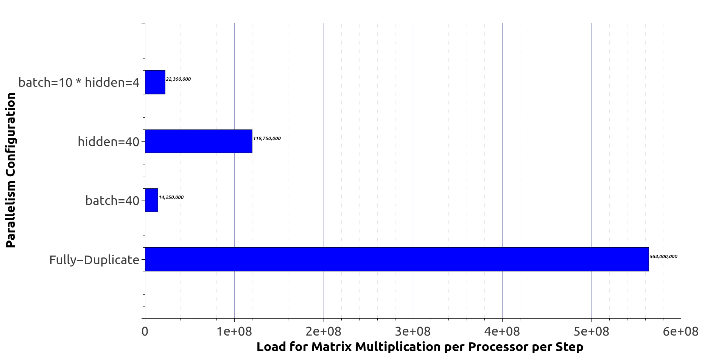

# Exploring RNN parallelism with Model Splitting

This repo is based on [Mesh-Tensorflow](https://github.com/tensorflow/mesh). Please read its instruction before you continue with this readme.

## Prerequisites
```
pip install mesh-tensorflow==0.0.5
```

## Run
```
python rnn-bench.py --hidden_size=200 --train_epochs=1 --epochs_between_evals=1 --log_steps=1 --eval_steps=2 --mesh_shape="b1:2;b2:2" --layout="hidden_1:b1;hidden_2:b2"
```
Hint: Please change the `mesh_shape` and `layout` parameters based on your own cpu conditions.

## Result
| RNN training speed in different computation modes |  Amortized computation load in different computation modes |
| :-------------------------:|:-------------------------: |
|  |  |
